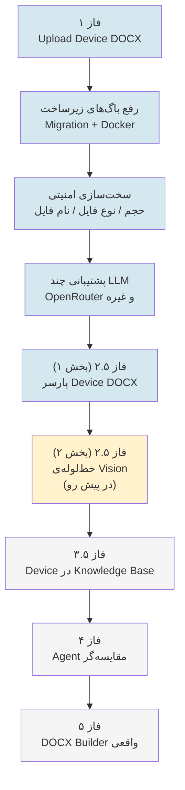
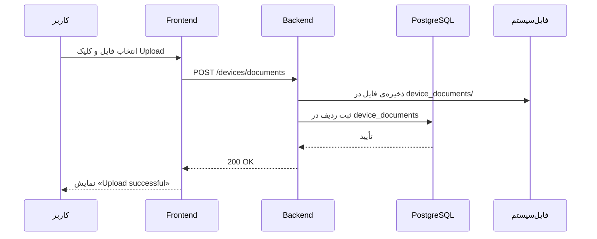
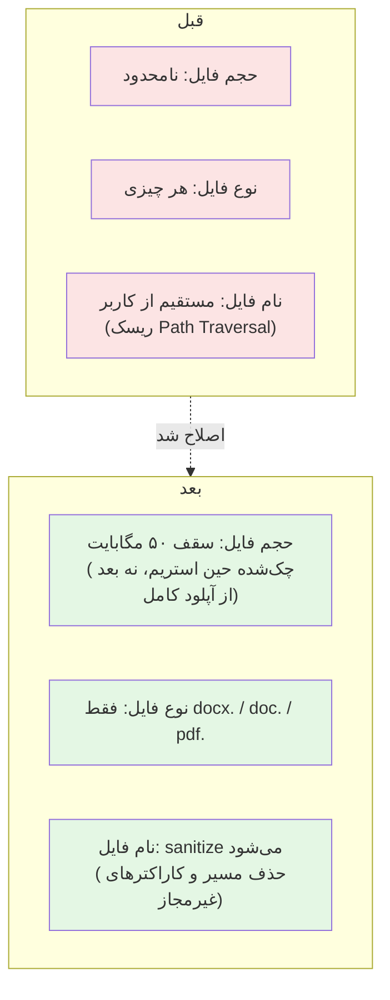
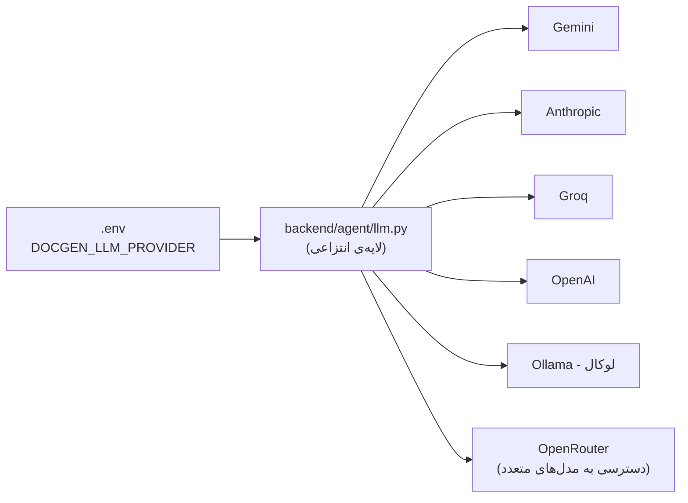
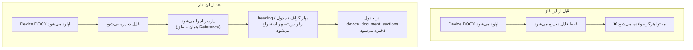
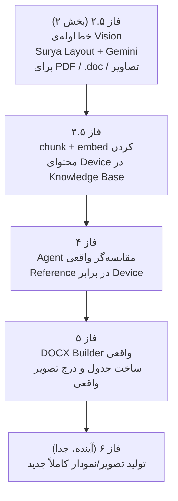

# گزارش پیشرفت پروژه Doc-Gen-System

> این سند، مکمل `README.md` اصلی است و به‌صورت گام‌به‌گام مسیری که تا این لحظه طی شده را مستند می‌کند: چه کاری، چرا، و چطور انجام شد. برای راه‌اندازی و معماری کلی پروژه به `README.md` مراجعه کنید.

---

## فهرست

1. [نمای کلی مسیر](#نمای-کلی-مسیر)
2. [فاز ۱ — آپلود سند Device](#فاز-۱--آپلود-سند-device)
3. [رفع باگ زیرساخت (Migration و Docker)](#رفع-باگ-زیرساخت-migration-و-docker)
4. [سخت‌سازی امنیتی آپلود](#سخت‌سازی-امنیتی-آپلود)
5. [پشتیبانی چندگانه از LLM (شامل OpenRouter)](#پشتیبانی-چندگانه-از-llm-شامل-openrouter)
6. [فاز ۲.۵ (بخش ۱) — پارسر ساختاری Device DOCX](#فاز-۲۵-بخش-۱--پارسر-ساختاری-device-docx)
7. [ساختار برنچ‌ها](#ساختار-برنچ‌ها)
8. [نقشه‌راه باقی‌مانده](#نقشه‌راه-باقی‌مانده)

---

## نمای کلی مسیر



بخش‌های آبی‌رنگ **انجام‌شده**، زرد **در پیش رو (قدم بعدی)**، و خاکستری **برنامه‌ریزی‌شده برای آینده** هستند.

---

## فاز ۱ — آپلود سند Device

**هدف:** امکان آپلود یک فایل سند (Word) و اتصال آن به یک Device، دقیقاً مشابه جریان آپلود Reference که از قبل وجود داشت.

**چه چیزی ساخته شد:**
- دکمه‌ی «Upload Device» در صفحه‌ی Devices
- Endpoint بک‌اند: `POST /devices/documents`
- مدل دیتابیس `DeviceDocument` و جدول `device_documents`
- اگر نام فایل با نام یک Device موجود مطابقت نداشته باشد، یک Device جدید به‌صورت خودکار ساخته می‌شود



---

## رفع باگ زیرساخت (Migration و Docker)

بعد از توسعه‌ی فاز ۱، هنگام تست چند مشکل زیرساختی کشف و رفع شد که ارزش مستندسازی دارند چون ممکن است دوباره رخ دهند:

| مشکل | علت | راه‌حل |
|---|---|---|
| `Failed to load devices` در صفحه‌ی Devices | جدول `alembic_version` روی یک revision id قدیمی/گم‌شده ثابت مانده بود که در فایل‌های migration فعلی وجود نداشت | مقدار `alembic_version` مستقیماً در دیتابیس روی آخرین revision تنظیم شد |
| `column device_documents.storage_path does not exist` | جدول `device_documents` از قبل (با ستون‌های قدیمی و متفاوت) در دیتابیس وجود داشت | جدول قدیمی drop و migration از نو روی آن اجرا شد |
| کد جدید در مرورگر دیده نمی‌شد | Docker از **ایمیج قدیمی و cache‌شده** استفاده می‌کرد، نه کد جدید | همیشه بعد از تغییر کد: `docker compose up -d --build --force-recreate <service>` |
| مدل embedding هر بار دوباره دانلود می‌شد | هیچ `volume` برای cache مدل‌های Hugging Face تعریف نشده بود | افزودن `huggingface_cache` volume به `docker-compose.yml` |

```mermaid
flowchart LR
    A[تغییر کد] --> B{"Docker rebuild شد؟"}
    B -- خیر --> C["❌ کانتینر قدیمی\nهنوز در حال اجراست"]
    B -- بله، با --build --force-recreate --> D["✅ کانتینر با کد جدید\nاجرا می‌شود"]
```

---

## سخت‌سازی امنیتی آپلود

نسخه‌ی اولیه‌ی آپلود Device هیچ محدودیتی نداشت (حجم نامحدود، هر نوع فایل، نام فایل خام). این ریسک‌های زیر شناسایی و برطرف شدند:



**تغییرات فنی:**
- `settings.max_device_document_upload_bytes` (پیش‌فرض: ۵۰ مگابایت) در `config.py`
- بررسی حجم به‌صورت **استریم** (نه بعد از آپلود کامل) در `device_document_service.py` — یعنی یک فایل حجیم عمداً‌ فرستاده‌شده، همان لحظه‌ی رسیدن به سقف متوقف می‌شود، نه بعد از پر شدن کامل دیسک
- محدودسازی پسوند به یک whitelist (`ALLOWED_EXTENSIONS`)
- تابع `_sanitize_filename` برای حذف اجزای مسیر (`../`) و کاراکترهای غیرمجاز از نام فایل
- هماهنگ‌سازی `client_max_body_size` در `nginx.conf` با همان سقف بک‌اند

---

## پشتیبانی چندگانه از LLM (شامل OpenRouter)

پروژه از قبل یک لایه‌ی انتزاعی (`backend/agent/llm.py`) برای چند LLM Provider داشت (Gemini، Anthropic، Groq، OpenAI، Ollama، و حتی OpenRouter) اما `OPENROUTER_API_KEY` در `docker-compose.yml` تعریف نشده بود. این مورد اضافه شد تا بتوان مدل‌های در دسترس روی OpenRouter (شامل مدل‌های آزمایشی/رایگان) را نیز امتحان کرد.



> نکته‌ی عملی که حین تست کشف شد: مدل‌های «reasoning» (مثل `GLM-5.3-flash` که پشت نام مستعار «Ox Alpha» بود) گاهی فیلد `content` را خالی برمی‌گردانند چون خروجی اصلی‌شان در بخش استدلال مصرف می‌شود؛ برای تولید سند نهایی، مدل‌های معمولی (مثل `gpt-4o-mini`) پایدارتر عمل کردند.

---

## فاز ۲.۵ (بخش ۱) — پارسر ساختاری Device DOCX

**مشکلی که حل شد:** تا پیش از این، فایل Device فقط ذخیره می‌شد و محتوای آن هرگز خوانده نمی‌شد — دقیقاً برخلاف Reference DOCX که ساختارش (heading، جدول، تصویر) استخراج می‌شد.



**اجزای فنی ساخته‌شده:**

| فایل | نقش |
|---|---|
| `models/device_document.py` | مدل جدید `DeviceDocumentSection` (مشابه `DocumentTemplate` ولی متصل به Device) |
| `db/migrations/versions/0007_device_document_sections.py` | Migration جدول جدید |
| `services/device_document_parser.py` | تابع `parse_and_store_sections` — از همان `extract_docx` و `split_sections` موجود (که از قبل عمومی بودند) استفاده می‌کند |
| `api/routes/devices.py` | Endpoint جدید `GET /devices/documents/{document_id}/sections` برای مشاهده‌ی نتیجه |

**محدودیت شناخته‌شده:** این پارسر فقط فایل‌های `.docx` را می‌خواند (چون `python-docx` مستقیماً از XML می‌خواند). فایل‌های `.doc` (قدیمی) و `.pdf` رد می‌شوند — بدون خراب کردن آپلود — و منتظر «خط‌لوله‌ی Vision» (بخش دوم فاز ۲.۵) می‌مانند.

**باگ کشف و رفع‌شده حین تست:** یک عنوان (heading) بلندتر از حد مجاز ستون دیتابیس (۲۵۵ کاراکتر) باعث کرش کل درخواست آپلود می‌شد (`StringDataRightTruncationError`). رفع شد با:
1. کوتاه‌سازی (truncate) مقادیر طولانی پیش از ذخیره
2. جداسازی تراکنش ذخیره‌ی section‌ها از تراکنش اصلی آپلود، تا خطای احتمالی بعدی در این بخش، آپلود فایل را از کار نیندازد

**نتیجه‌ی تست واقعی:** روی یک فایل نمونه‌ی ۱۷ صفحه‌ای (`Input-GUI_VL8.docx`)، ۲۱ section با موفقیت استخراج شد — شامل عنوان‌ها، متن، و جدول‌ها (مثل `Settings Page` و جدول استانداردها).

---

## ساختار برنچ‌ها

```mermaid
gitGraph
    commit id: "master"
    branch "feature/new-feature-document-update"
    checkout "feature/new-feature-document-update"
    commit id: "فاز ۱: آپلود Device"
    checkout master
    merge "feature/new-feature-document-update"
    branch "fix/device-upload-security"
    checkout "fix/device-upload-security"
    commit id: "سخت‌سازی امنیتی"
    commit id: "docker-compose:\nhuggingface + OpenRouter"
    branch "feature/document-parser-v2"
    checkout "feature/document-parser-v2"
    commit id: "فاز ۲.۵: پارسر Device"
    commit id: "رفع باگ طول متن"
    checkout "fix/device-upload-security"
    merge "feature/document-parser-v2"
```

| برنچ | محتوا | وضعیت |
|---|---|---|
| `feature/new-feature-document-update` | فاز ۱ (آپلود Device) | ✅ merge شده به master |
| `fix/device-upload-security` | سخت‌سازی امنیتی + تنظیمات docker-compose + فاز ۲.۵ (پارسر) | فعلاً روی این برنچ کار می‌شود |

---

## نقشه‌راه باقی‌مانده



جزئیات کامل هر فاز (شامل ابزارهای قابل‌نصب و مقایسه‌ی مدل‌های Vision) در سند جداگانه‌ی نقشه‌راه پروژه موجود است.

---

*آخرین به‌روزرسانی: این سند به‌صورت دستی هم‌زمان با پیشرفت پروژه به‌روزرسانی می‌شود.*
